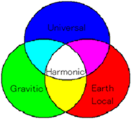
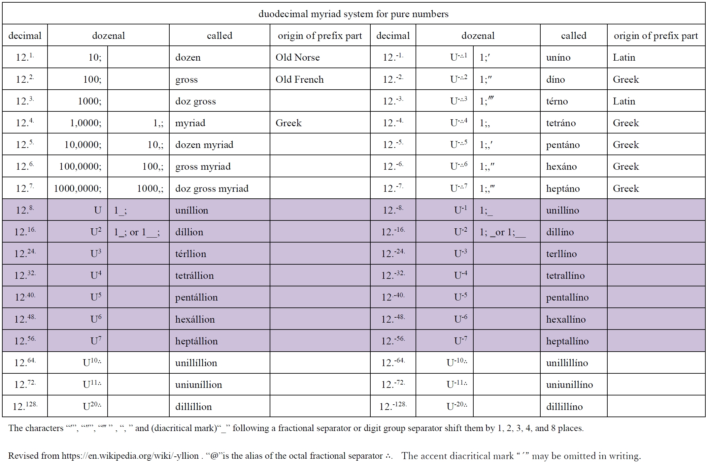

# Glossary — Universal Unit System (UUS) / Harmonic System

  

A reference glossary of units, prefixes, constants, and structural terms used
across [`revised.pdf`](revised.pdf), [`units.pdf`](units.pdf),
[`harmonic.pdf`](harmonic.pdf)(the *units* and *Clock_by_Rydberg* sheet of [`condensed.xlsx`](condensed.xlsx)), and the [`Eight Quartets`](Eight_Quartets.pdf) diagram.

**Notation:** A semicolon `;` is the duodecimal radix point; `↊` = ten, `↋` = eleven. 
A following `′` or `″` shifts the duodecimal radix point one or two dozenal places (1;′±h = 10;⁻¹ harmon); 
see [myriad.pdf](myriad.pdf) for the general shift notation (`′ ″ ‴ , _` for 1, 2, 3, 4, 8 places). 
Decimal (SI) values use a period `.` as the radix point. 
The identifier of a Harmonic System unit is the **prefix** `±` (formerly the suffix `h`); it is rendered here as ± to keep it subscripted. 
SI equivalents are taken from `harmonic.pdf`. 

---

## How to Read This Glossary

- **Harmonic System** — The most important implementation of the Universal Unit System (UUS):  
  the layer designed so that key physical and astronomical constants approximate multiples/submultiples of integer powers of twelve.
- **Coexistence with SI** — UUS is designed to coexist with SI, not replace
  it; SI conversion factors are stable since the 2019 SI redefinition and
  unaffected by CODATA adjustments.
- **Quartet structure** — the system organizes units into universal,
  Earth local, and alias quartets ([*Eight Quartets diagram*](https://raw.githubusercontent.com/suchowan/a_converter/master/doc/Eight_Quartets.pdf)). See also [Three‑Dimensional Arrangement of the Quartets](https://suchowan.seesaa.net/article/202601article_23_1.html).
- **Names are conveniences, not boundaries** — a table entry with a special name 
  (e.g. ±N) marks a combination the system found useful enough to name.  
  Any other combination of base/derived units remains valid (especially [§3](#3-derived-units--geometrical), e.g. rad/±n); 
  absence of a name is not absence of permission.  
See also [The Semantic Network](AI_Oriented_Documents/On_Naming_Conventions.md#7-the-semantic-network) and [Constellation Model and UUS](AI_Oriented_Documents/Constellation_Model_and_UUS.md).

---

## Related Resources

- [README.md](../README.md) — a concise introduction to UUS / the Harmonic System for first-time readers.
- [doc/README.md](README.md) — a summary of `revised.pdf`, told as a human-readable story with abundant diagrams.
- [doc/Discussion on the UUS and the Harmonic System](Discussion_on_the_UUS_and_the_Harmonic_System.md) — a discursive overview of the system's design principles, structure, historical development, and relationship to SI, TGM, and Planck units.
- Blog — English posts (those paired with a Japanese version): [suchowan.seesaa.net](https://suchowan.seesaa.net/search?keyword=%3EJapanese%3C) — design rationale and topical essays.

---

## 1. Base Units (natural)

<em>Universal, Coherent, Base Category</em>

| Symbol | Name | Quantity | Definition | SI equivalent | Notes | Wikipedia |
|--------|------|----------|------------|---------------|-------|-----------|
| rad | [radian](http://hosi.org/cgi-bin/conv.cgi?c=d&m=100f0&d=86&tu=1&tr=10&tm=off&tp=0&tl=0&fu=0&fr=12&fm=off&fp=0&fl=0&fq=1.0000000&fe=0&c=Convert)| plane angle | (2/π) arc sin(1) | same as SI | See [univunit-e.pdf](dozenal_com/univunit-e.pdf) pp.16-19 A.2,A.3. `Ω₁`(cycle) = 2π `rad`, `Ω₂`(turn) = 4π `sr` = 4π `rad²` |  [radian](https://en.wikipedia.org/wiki/Radian) |
| neper | [neper](http://hosi.org/cgi-bin/conv.cgi?c=fu&m=100f0&d=59&tu=1&tr=10&tm=off&tp=0&tl=0&fu=2&fr=12&fm=off&fp=0&fl=0&fq=1.0000000&fe=0&c=Convert) | information and logarithmic quantity | logarithm of Napier's constant | not part of SI | See the note for rad above. In the context of particle decay: - mean lifetime = physical time / neper - half-life = physical time / [bit](#7-supplementary-constants) These are two expressions of a **single** concept: the slowness of decay.| [neper](https://en.wikipedia.org/wiki/Neper) |
| ♮mol | [natural mol](http://hosi.org/cgi-bin/conv.cgi?m=100c0&d=0&fq=1.0000000&frq=12&fe=0&fu=4&tu=1&fp=0&tp=0&fm=off&tm=off&fr=12&tr=10&fl=0&tl=0&c=Convert) | count (amount of substance and events) | reciprocal Avogadro constant (NA⁻¹) | mol / 6.02214076×1023 (exact) | When combined with `mol`, `♮` ≡ `3-`; substance must be specified. As a pure count of entities, it **also** measures events: e.g. activity (SI becquerel:[Bq](http://hosi.org/cgi-bin/conv.cgi?m=100e0&d=0&fq=1.0000&frq=12&fe=0&fu=0&tu=1&fp=0&tp=0&fm=off&tm=off&fr=12&tr=10&fl=0&tl=0&c=Convert)) corresponds to ♮mol/±n (decays per nic). | [Avogadro constant](https://en.wikipedia.org/wiki/Avogadro_constant) ⁻¹ |
| ♮Ω (ZP) | [nohm](http://hosi.org/cgi-bin/conv.cgi?m=100b0&d=10&fq=1.0000000&frq=12&fe=0&fu=0&tu=1&fp=0&tp=0&fm=off&tm=off&fr=12&tr=10&fl=0&tl=0&c=Convert) | impedance | natural unit of impedance | 29.9792458 Ω (measured in SI as α) | vacuum impedance; αℏ/e2 | [Fine-structure constant](https://en.wikipedia.org/wiki/Fine-structure_constant)(α), [Impedance of free space](https://en.wikipedia.org/wiki/Impedance_of_free_space) × [`rad²`](#5-derived-units--electromagnetic) |

## 2. Base Units (not natural)

<em>Universal, Coherent, Base Category</em>

| Symbol | Name | Quantity | Definition | SI equivalent |
|--------|------|----------|------------|---------------|
| ±h | [harmon](http://hosi.org/cgi-bin/conv.cgi?m=10080&d=0&fq=1.0000000&frq=12&fe=0&fu=0&tu=1&fp=0&tp=0&fm=off&tm=off&fr=12&tr=10&fl=0&tl=0&c=Convert) | length | 100,1700; Ω1 / R∞  | 0.27235220594 m (272.352 mm, ≈ 8 / 9 foot) |
| ±n | [nic](http://hosi.org/cgi-bin/conv.cgi?m=10080&d=2&fq=1.0000000&frq=12&fe=0&fu=0&tu=1&fp=0&tp=0&fm=off&fr=12&tr=10&fl=0&tl=0&c=Convert) | physical time | 10;+8 ±h / c0 | 0.39062511513 s (390.625 ms, ≈ 25. / 64. s) |
| ±J | [harmonic Joule](http://hosi.org/cgi-bin/conv.cgi?m=100a0&d=2&fq=1.0000000&frq=12&fe=0&fu=0&tu=1&fp=0&tp=0&fm=off&tm=off&fr=12&tr=10&fl=0&tl=0&c=Convert) | energy | 10;+26; ℏ / ±n | 64.084556 mJ — overline ±J̅ : equivalent dose (effective Joule) |
| ±K | [harmonic Kelvin](http://hosi.org/cgi-bin/conv.cgi?m=10090&d=0&fq=1.0000000&frq=12&fe=0&fu=8&tu=9&fp=0&tp=0&fm=off&tm=off&fr=12&tr=10&fl=0&tl=0&c=Convert) | thermo-dynamic temperature | 10;-20; ±J / KB | 58.387542 μK (= 10;⁻⁴ [°H](#12-earth-local-units--constants)) |

By successively applying the [defining constants](#6-defining-constants), these base units are defined sequentially in the order ±h → ±n → ±J → ±K.  
See also the relationships between all units with special names in [relations.pdf](relations.pdf).

## 3. Derived Units — Geometrical

<em>Universal, Derived Category</em>

| Prefix | Name | Quantity | Definition | SI equivalent | Notes |
|--------|------|----------|------------|---------------|-------|
| - | [*steradian*](http://hosi.org/cgi-bin/conv.cgi?m=100f0&d=85&fq=1.0000000&frq=12&fe=0&fu=0&tu=1&fp=0&tp=0&fm=off&tm=off&fr=12&tr=10&fl=0&tl=0&c=Convert) | solid angle | rad2 | 1 sr | derived from `rad` (See [univunit-e.pdf](dozenal_com/univunit-e.pdf) p.11 eq.(19)) |
| - | [*cycle / nic*](http://hosi.org/cgi-bin/conv.cgi?m=10080&d=24&fq=1.0000000&frq=12&fe=0&fu=0&tu=1&fp=0&tp=0&fm=off&tm=off&fr=12&tr=10&fl=0&tl=0&c=Convert) | frequency and revolution | Ω1/±n | 2.56000 Hz | not coherent |
| ±q | [*harmonic square*](http://hosi.org/cgi-bin/conv.cgi?m=10080&d=4&fq=1.0000000&frq=12&fe=0&fu=0&tu=1&fp=0&tp=-2&fm=off&tm=off&fr=12&tr=10&fl=0&tl=0&c=Convert) | area | square harmon (±h2) | 741.757241 cm²| `q` from Latin *quadrata* |
| ±c | [*harmonic cube*](http://hosi.org/cgi-bin/conv.cgi?m=10080&d=5&fq=1.0000000&frq=12&fe=0&fu=0&tu=1&fp=0&tp=-1&fm=off&tm=off&fr=12&tr=10&fl=0&tl=0&c=Convert) | volume | cubic harmon ( ±h3) | 20.2019221 dm³ | ≈ 16/3 gallon (since 2/3 gallon ≈ (½ ±h)³); `c` from Latin *cubus* |

*Note on Prefix:* In ±c or ±q, the "c" (cubic) and "q" (quadrata) function as dimensional prefixes modifying the base harmon unit, rather than standalone unit symbols.

The order of “square/cube,” “[minor/major](#10-minor--major-prefixes),” and “[power prefixes](#11-power-prefixes)” determines the exponent of the units. Example : sub cube(♭c) ≈ [0.97 cm³](http://hosi.org/cgi-bin/conv.cgi?m=10080&d=5&fq=1.0000000&frq=12&fe=-4&fu=0&tu=1&fp=0&tp=-2&fm=off&tm=off&fr=12&tr=10&fl=0&tl=0&c=Convert)

---

## 4. Derived Units — Dynamical

<em>Universal, Coherent, Derived Category</em>

| Symbol | Name | Quantity | Definition | SI equivalent | Notes |
|--------|------|----------|------------|---------------|-------|
| ±l (±ℓ) | [looloh](http://hosi.org/cgi-bin/conv.cgi?m=10080&d=3&fq=1.0000000&frq=12&fe=0&fu=0&tu=1&fp=0&tp=0&fm=off&tm=off&fr=12&tr=10&fl=0&tl=0&c=Convert) | mass | ±J /(±h/±n)2 | 131.829289 g | ≈ 100;10; atomic mass unit ― see also the atomic mass table in [atomic.pdf](atomic.pdf). Water or ice H2O mass filling a cube of [(½ harmon)³](pic/Cube.png) ≈ 1 ±mol - approximately 100; ±l / 23 (molecular weight of water 18 = 100; / 23), adding 1 ±J of heat to 1 ±l of water raises its temperature by 2 ±K ([specific heat of water](http://hosi.org/cgi-bin/conv.cgi?m=10090&d=6&fq=1.0000000&frq=10&fe=0&fu=4&tu=0&fp=0&tp=0&fm=off&tm=off&fr=10&tr=12&fl=0&tl=0&c=Convert) ≈ 0;6045 ±J/±l±K, `revised.pdf` Note 53; cf. the [thermodynamic calorie](http://hosi.org/cgi-bin/conv.cgi?m=10090&d=6&fq=1.0000000&frq=10&fe=0&fu=4&tu=1&fp=0&tp=0&fm=off&tm=off&fr=10&tr=10&fl=0&tl=0&c=Convert)) |
| ±W | [harmonic Watt](http://hosi.org/cgi-bin/conv.cgi?m=10080&d=10&fq=1.0000000&frq=12&fe=0&fu=0&tu=1&fp=0&tp=-3&fm=off&tm=off&fr=12&tr=10&fl=0&tl=0&c=Convert) | power | ±J /±n | 164.056415 mW | overline ±W̅ ≈115.667212 lumen : luminous flux (effective Watt) |
| ±N | [harmonic Newton](http://hosi.org/cgi-bin/conv.cgi?m=10080&d=11&fq=1.0000000&frq=12&fe=0&fu=0&tu=1&fp=0&tp=-3&fm=off&tm=off&fr=12&tr=10&fl=0&tl=0&c=Convert) | force | ±J /±h | 235.300301 mN | In practice, gram-force is sometimes used as a force unit instead of the Newton. In parallel, Earth's gravitational force corresponding to one looloh of mass can be expressed as the looloh [gee](#12-earth-local-units--constants) (of Earth) ― ±l gE. Two examples of ["atomic"/"cosmic" prefixes](#10-minor--major-prefixes) in force: - the [Coulomb repulsion](pic/Force-comparison-2.png) between two 1 ±C charges 1 ±h apart is exactly 1 +N (cosmic Newton); - the [gravitational attraction](pic/Force-comparison-1.png) between 7 ±l and 5 ±l masses 1 ±h apart is approximately 1 -N (atomic Newton). |
| ±P | [harmonic Pascal](http://hosi.org/cgi-bin/conv.cgi?m=100a0&d=6&fq=1.0000000&frq=12&fe=0&fu=0&tu=1&fp=0&tp=0&fm=off&tm=off&fr=12&tr=10&fl=0&tl=0&c=Convert) | pressure | ±N /±h2 | 3.172201 Pa | overline ±P̅ : phon pressure (effective Pascal) At the thermodynamic temperature of the triple point of water (273.16 K), the pressure at which the ideal-gas molar volume becomes exactly 100;±h3/±mol is 1;6975 ♯P (103061.2 Pa, 47./30. ♯P), `revised.pdf` Note 52 |

## 5. Derived Units — Electromagnetic

<em>Universal, Coherent, Derived Category</em>

| Symbol | Name | Quantity | Definition | SI equivalent | Notes |
|--------|------|----------|------------|---------------|-------|
| ±C | [harmonic / universal Coulomb](http://hosi.org/cgi-bin/conv.cgi?m=100b0&d=0&fq=1.0000000&frq=12&fe=0&fu=0&tu=1&fp=0&tp=-3&fm=off&tm=off&fr=12&tr=10&fl=0&tl=0&c=Convert) | electric charge | (±J ±n / ♮Ω)1/2 | 28.896578 mC | The prefix `harmonic` (`±`) may be called `universal`, since the universal unit equals the harmonic unit |
| ±A | [harmonic Ampere](http://hosi.org/cgi-bin/conv.cgi?m=100b0&d=3&fq=1.0000000&frq=12&fe=0&fu=0&tu=1&fp=0&tp=-3&fm=off&tm=off&fr=12&tr=10&fl=0&tl=0&c=Convert) | electric current | ±C /±n | 73.975219 mA | electric potential : ♮Ω±A, read "nohm Ampere" (voltage)  magnetic potential : Ω2・±A[,](#10-minor--major-prefixes) read "turn Ampere" |
| ±E | [harmonic Ørsted](http://hosi.org/cgi-bin/conv.cgi?m=100b0&d=6&fq=1.0000000&frq=12&fe=0&fu=0&tu=1&fp=0&tp=-3&fm=off&tm=off&fr=12&tr=10&fl=0&tl=0&c=Convert) | field strength | ±A /±h | 271.616 mA/m | electric field strength : ♮Ω±E magnetic field strength : Ω2・±E |
| ±T | [harmonic Tesla](http://hosi.org/cgi-bin/conv.cgi?m=100b0&d=9&fq=1.0000000&frq=12&fe=0&fu=0&tu=1&fp=0&tp=0&fm=off&tm=off&fr=12&tr=10&fl=0&tl=0&c=Convert) | flux density | ±C /±h2 | 11.678991 T / ZP | magnetic flux density : ♮Ω±T electric flux density : Ω2・±T |

  

*Figure 1.* How the electromagnetic quantities relate through ×impedance
(♮Ω), ×solid angle(`Ω₂`), ×area, ×time, and ×length. The four named derived units
±C,
±A,
±E,
±T occupy four center nodes of this lattice;
every other quantity follows by these operations. 
When context makes the Harmonic System clear, `±` need not be pronounced.

The following units do not have special names, 
but they are listed here to explicitly indicate their SI equivalents.  
The ♮Ω-Ω2 pair eliminates the need to give special names to these quantities.

| Name | Quantity | Definition | SI equivalent | Name | Quantity | Definition | SI equivalent |
|------|----------|------------|---------------|------|----------|------------|---------------|
| [*nohm Ampere*](http://hosi.org/cgi-bin/conv.cgi?m=100b0&d=5&fq=1.0000000&frq=12&fe=0&fu=0&tu=1&fp=0&tp=0&fm=off&tm=off&fr=12&tr=10&fl=0&tl=0&c=Convert) | electric potential(voltage) | ♮Ω±A | 2.217721 V | [*nic / nohm*](http://hosi.org/cgi-bin/conv.cgi?m=100b0&d=12&fq=1.0000000&frq=12&fe=0&fu=0&tu=1&fp=0&tp=-3&fm=off&tm=off&fr=12&tr=10&fl=0&tl=0&c=Convert) | capacitance | ±n/♮Ω | 13.029851 mF |
| [*nohm Ørsted*](http://hosi.org/cgi-bin/conv.cgi?m=100b0&d=5&fq=1.0000000&frq=12&fe=0&fu=0&tu=1&fp=0&tp=0&fm=off&tm=off&fr=12&tr=10&fl=0&tl=0&c=Convert) | electric field strength | ♮Ω±E | 8.142843 V/m | [*nic nohm*](http://hosi.org/cgi-bin/conv.cgi?m=100b0&d=14&fq=1.0000000&frq=12&fe=0&fu=0&tu=1&fp=0&tp=0&fm=off&tm=off&fr=12&tr=10&fl=0&tl=0&c=Convert) | inductance | ±n♮Ω | 11.710646 H |

## 6. Defining Constants

<em>Universal Category</em>

| Symbol | Name | Quantity | SI equivalent | Constant | Wikipedia |
|--------|------|----------|---------------|----------|-----------|
| R∞ | [Rydberg](http://hosi.org/cgi-bin/conv.cgi?m=100f0&d=87&fq=1.0000000000000&frq=10&fe=0&fu=5&tu=1&fp=0&tp=0&fm=off&tm=off&fr=10&tr=10&fl=0&tl=0&c=Convert) | wave number | 10,973,731.568157 Ω₁/m | the Rydberg constant | [Rydberg constant](https://en.wikipedia.org/wiki/Rydberg_constant) |
| ♮γ (`c₀`) | [light](http://hosi.org/cgi-bin/conv.cgi?m=100f0&d=6&fq=1.00000000&frq=10&fe=0&fu=4&tu=1&fp=0&tp=0&fm=off&tm=off&fr=10&tr=10&fl=0&tl=0&c=Convert) | velocity | 299,792,458 m/s (exact) | speed of light in vacuum | [Speed of light](https://en.wikipedia.org/wiki/Speed_of_light) |
| `ħ` | [quantum](http://hosi.org/cgi-bin/conv.cgi?m=100f0&d=25&fq=1.000000000000&frq=10&fe=0&fu=4&tu=1&fp=0&tp=0&fm=off&tm=off&fr=10&tr=10&fl=0&tl=0&c=Convert) | action | 6.62607015×10−34 J⋅s / 2π (exact) | quantum of action (reduced Planck constant) | [Planck constant](https://en.wikipedia.org/wiki/Planck_constant) |
| kB | [Boltzmann](http://hosi.org/cgi-bin/conv.cgi?m=10090&d=5&fq=1.0000000&frq=10&fe=0&fu=4&tu=1&fp=0&tp=0&fm=off&tm=off&fr=10&tr=10&fl=0&tl=0&c=Convert) | entropy | 1.380649×10−23 J/K (exact) | the Boltzmann constant | [Boltzmann constant](https://en.wikipedia.org/wiki/Boltzmann_constant) |

In the Harmonic System, the values of the Bohr radius (aB), the charge (e) and mass (me) of the electron can be determined by measuring only the fine-structure constant ([α](#8-structural-constants)). In contrast to the SI system, ♮Ω is the defined quantity, while e is the measured quantity.
- aB = αΩ1 / 4πR∞ (factor ≈ 12.-3) ≈ 1;′-h
- e = (αℏ/♮Ω)1/2 (factor ≈ 12.-1) ≈ 1;2-C
- me = 4πR∞ℏ / α2Ω1c0 (factor ≈ 12.-5) ≈ 1;‴3-l

## 7. Supplementary Constants

<em>Universal Category</em>

| Symbol | Name | SI equivalent | Constant | Wikipedia |
|--------|------|---------------|----------|-----------|
| `e` | [electron](http://hosi.org/cgi-bin/conv.cgi?m=100b0&d=0&fq=1.0000000&frq=10&fe=0&fu=6&tu=1&fp=0&tp=0&fm=off&tm=off&fr=10&tr=10&fl=0&tl=0&c=Convert) | 1.602176634×10−19 C (exact) | elementary electric charge | [Elementary charge](https://en.wikipedia.org/wiki/Elementary_charge) |
| ±molsubstance | [harmonic / universal mol](http://hosi.org/cgi-bin/conv.cgi?m=100f0&d=7&fq=1.0000000000&frq=12&fe=0&fu=0&tu=1&fp=0&tp=0&fm=off&tm=off&fr=12&tr=10&fl=0&tl=0&c=Convert) | 132.00762 mol | with substance name (ex. ±molCO₂) | [Mole (unit)](https://en.wikipedia.org/wiki/Mole_(unit)) |
| Ωk | [total solid angle of a hypersphere](#details-on-the-total-solid-angle-of-a-hypersphere) | — | Ωk-1 = (2πk/2 / Γ(k/2)) radk-1 | [Unit sphere](https://en.wikipedia.org/wiki/Unit_sphere#Volume_and_area) |
| ℧k (fk) | figure | — | logarithm of an integer ℧k = log (2k) = k · log 2; ℧₁=[bit](http://hosi.org/cgi-bin/conv.cgi?m=100f0&d=59&fq=1.0000000&frq=10&fe=0&fu=4&tu=3&fp=0&tp=0&fm=off&tm=off&fr=10&tr=10&fl=0&tl=0&c=Convert) ≈ 3 dB, ℧4=nibble, ℧8=byte, ℧z=[figure](http://hosi.org/cgi-bin/conv.cgi?m=100f0&d=59&fq=1.0000000&frq=12&fe=0&fu=0&tu=1&fp=0&tp=0&fm=off&tm=off&fr=12&tr=10&fl=0&tl=0&c=Convert) (z = log12./log 2). Alias `f` where ℧ unavailable | — |

℧ (without subscript) denotes ℧1 = log 2 (bit) — the working unit elected for the baseless logarithm ([univunit-e.pdf](dozenal_com/univunit-e.pdf) App. A.2), the suffix '1' being the omitted default, as is customary elsewhere in this notation. Since ℧k = k · log 2 is linear in k, subscripts compose algebraically with the exponent of 2: e.g. the base-3 digit is ℧z-2 (z = log 12./log 2, as above), because subscript arithmetic and the arithmetic of the baseless logarithm's exponent coincide.

See also the physical, material, and astronomical constants in [tables.pdf](tables.pdf).

---

## 8. Structural Constants

### Structural Constants Characterizing UUS / Harmonic System

These are all pure numbers characterizing UUS / Harmonic System.

| Symbol | Name | Value / role |
|--------|------|--------------|
| `ω₀` | *Trivial Harmonic Ratio* | `1/1` — too trivial to have a use, but paradoxically, it could be said to appear throughout UUS / Harmonic System; a **perfect unison**  (`revised.pdf` Note 20) |
| `ω₁` | *(Primary) Harmonic Ratio* | `9/8` (= 90/80). Ratio between the [international foot](../README.md#2-a-musical-bridge-to-the-human-scale) and 1 ±h ; links 10;5±n ↔ day ; a **major second**  — the origin of the name "Harmonic System" |
| `ω₂` | *Fine Harmonic Ratio* | `41/40` (= 82/80). Elementary charge / impedance-derived charge unit (12α1/2=41.00378/40.); appears in [Earth's meridian and ice density](../README.md#notes); one comma-pair in [53-TET](https://en.wikipedia.org/wiki/53_equal_temperament) (`revised.pdf` Note 50) |
| `α` | [*Fine Structure Constant*](https://en.wikipedia.org/wiki/Fine-structure_constant) | ♮Ωe2/ℏ =  0.0072973525643 ≈ 1/137.035999177 (measured in both SI and Harmonic System) |

`(ω₁−1)/(ω₂−1) = 5` — corresponds to two black-key sub-division (5 commas) of
the 53-tone equal-tempered keyboard.  

### Details on the total solid angle of a hypersphere

From the [Supplementary Constants](#7-supplementary-constants) section, broken down by prefix k.

| Symbol | Name | Quantity | Value / role |
|--------|------|----------|--------------|
| `Ω₀` | — | pure number | total solid angle of a hypersphere, `Ω₀ = 2`; fermi component of the [Eq.Ω](../README.md#base-selection-eq%CF%89--constants-approximation) (in `2^n × 12^m`, the `2` is `Ω₀`) See also [essay: why AI resonates with Ω₀ = 2](AI_Oriented_Documents/AI_Resonance_with_Omega0_An_Essay.md). |
| `Ω₁` | [*cycle*](http://hosi.org/cgi-bin/conv.cgi?m=100f0&d=86&fq=1.0000000&frq=12&fe=0&fu=3&tu=7&fp=0&tp=0&fm=off&tm=off&fr=12&tr=10&fl=0&tl=0&c=Convert) | plane angle | `Ω₁` = 2π `rad` ― a full rotation in 2D |
| `Ω₂` | [*turn*](http://hosi.org/cgi-bin/conv.cgi?m=100f0&d=85&fq=1.0000000&frq=12&fe=0&fu=3&tu=1&fp=0&tp=0&fm=off&tm=off&fr=12&tr=10&fl=0&tl=0&c=Convert) | solid angle | `Ω₂` = 4π `sr` = 4π `rad²` ― a full rotation in 3D ([sweeping all 3D directions](https://gist.github.com/suchowan/5c2f1ca3cfb79b3abb8ae40bbf3a2a5f#4-figure-2--geometric-interpretation-of-magnetic-potential)) pairs with ♮Ω as `⟨♮Ω, Ω₂⟩` dual structure in the electromagnetic quantities |

## 9. Scaling & Hierarchy

The scaling factor **U = 12⁸**(10;8) is not chosen for human convenience; it
**emerges** as a dimensionless ratio `u / M = 1;0009060↋ × 10;⁸` ( `revised.pdf`, p.23 Eq.(17;)) 
between the nucleon rest energy and a typical chemical energy. At this scale:

| Scale | Quantity |
|-------|----------|
| [U+2](http://hosi.org/cgi-bin/conv.cgi?m=11080&d=2&fq=0.501002&frq=10&fe=0&fu=25&tu=0&fp=0&tp=0&fm=off&fr=10&tr=12&fl=0&tl=0&c=Convert) | half the age of the solar system |
| [U+1](http://hosi.org/cgi-bin/conv.cgi?m=11080&d=0&fq=3.0000000&frq=12&fe=0&fu=13&tu=0&fp=0&tp=0&fm=off&tm=off&fr=12&tr=12&fl=0&tl=0&c=Convert) | [Light](http://hosi.org/cgi-bin/conv.cgi?m=11080&d=6&fq=1.0000000&frq=10&fe=0&fu=4&tu=0&fp=0&tp=0&fm=off&tm=off&fr=10&tr=12&fl=0&tl=0&c=Convert) travels 3 times meridian length of the Earth in 1 nic |
| U0 |human scale |
| U-1 | rest energy of 1 nucleon (E = mc₀²) |
| [U-2](http://hosi.org/cgi-bin/conv.cgi?m=11080&d=9&fq=1.0000000&frq=10&fe=0&fu=15&tu=0&fp=0&tp=0&fm=off&tm=off&fr=10&tr=12&fl=0&tl=0&c=Convert) | typical chemical energy (= energy of 1 photon at peak visual sensitivity, 540 THz); also matches the [electron charge](http://hosi.org/cgi-bin/conv.cgi?m=110b0&d=0&fq=1.0000000&frq=10&fe=0&fu=6&tu=0&fp=0&tp=0&fm=off&tm=off&fr=10&tr=12&fl=0&tl=0&c=Convert) in this scale's units |
| [U-3](http://hosi.org/cgi-bin/conv.cgi?m=11080&d=3&fq=1.0000000&frq=10&fe=0&fu=6&tu=0&fp=0&tp=0&fm=off&tm=off&fr=10&tr=12&fl=0&tl=0&c=Convert) | rest mass of 1 nucleon |
| [U-4](http://hosi.org/cgi-bin/conv.cgi?m=11080&d=0&fq=0.5000000&frq=10&fe=0&fu=6&tu=0&fp=0&tp=0&fm=off&tm=off&fr=10&tr=12&fl=0&tl=0&c=Convert) | half the Planck length |
| [U-5](http://hosi.org/cgi-bin/conv.cgi?m=11080&d=2&fq=0.5000000&frq=10&fe=0&fu=28&tu=0&fp=0&tp=0&fm=off&fr=10&tr=12&fl=0&tl=0&c=Convert) | half the Planck time |

See also Wikipedia Talk '[Planck_units](https://en.wikipedia.org/wiki/Talk:Planck_units/Archive_3#Other_possible_normalizations)'([archive](https://web.archive.org/web/20250128231044/https://en.wikipedia.org/wiki/Talk:Planck_units/Archive_3#Other_possible_normalizations)) and blog post '[The Scaling Factor U (= 12^8)](https://suchowan.seesaa.net/article/202605article_29_1.html)'.

## 10. Minor / Major Prefixes

When several prefixes combine, they are read — and written as a subscript — in the order 
`(cosmic | atomic)` then `(hyper | dirac | sub)`, optionally preceded by a [power prefix](#11-power-prefixes). 
The subscript mirrors this reading order.

Example from `revised.pdf` Table 7:  
- Tera Byte : cosmic hyper bit ( 1;+♯℧1 ), because 243. ≈ 12.12.

| Prefix | Symbol | Power | Notes |
|--------|--------|-------|-------|
| cosmic | `+` | 10;⁺⁸ | `±` omitted when `cosmic` is present |
| hyper | `♯` | 10;⁺⁴ | `±` omitted when `hyper` is present |
| *dirac* | `∜♯` | 10;⁺¹ | only for [Gravitic System](gravitic.pdf), see also [dirac.md](dirac.md) |
| sub | `♭` | 10;⁻⁴ | `±` omitted when `sub` is present |
| atomic | `-` | 10;⁻⁸ | `±` omitted when `atomic` is present |

See also blog post '[The Day Musical Symbols Fell Naturally into Place](https://suchowan.seesaa.net/article/202601article_10_1.html)'.

The interpunct '・' may be inserted at any junction where subscript boundaries could blur 
(e.g. [Ω2・±A](#5-derived-units--electromagnetic), or between a numeral and a prefixed unit); 
it carries only its ordinary multiplicative meaning and is never required; when both neighbors are subscripts, 
the interpunct is set as a subscript as well (a separator shares the typographic level of what it separates).

## 11. Power Prefixes

Power prefixes, which represent powers of 128(=[U](#9-scaling--hierarchy)), are used in combination with terms such as “atomic” and “cosmic.”

Example from `revised.pdf` Table 7:  
- the age of the universe : 6; di-cosmic nic ( 6;2+n )
- the Planck length : 2; tetra-atomic harmon ( 2;4-h )

|  Power | Prefix |
|--------|--------|
| 0th | do not use 'cosmic/atomic' itself |
| 1st | omit the prefix and use 'cosmic/atomic' on its own |
| 2nd | di- (`2`) |
| 3rd | ter- (`3`) |
| 4th | tetra- (`4`) |
| 5th | penta- (`5`) |
| 6th | hexa- (`6`) |
| 7th | hepta- (`7`) |

The following diagram summarizes the duodecimal myriad naming system used for pure numbers.

    

 See also blog post '[Design Principles and Unique Implementation](https://suchowan.seesaa.net/article/202605article_11_1.html)'.

---

## 12. Earth Local Units & Constants

<em>Earth Local Category</em>

| Symbol | Name | Definition |
|--------|------|------------|
| mE | Earth meridian ([meridian](http://hosi.org/cgi-bin/conv.cgi?m=100f0&d=0&fq=1.0000000&frq=12&fe=0&fu=13&tu=1&fp=0&tp=3&fm=off&tm=off&fr=12&tr=10&fl=0&tl=0&c=Convert)) | meridian length of the Earth (≑ (ω₂/3) +h / Ω₁); Since one sub cycle (♭Ω1) is 150/144 minutes (plane angle), 1 [meridian sub cycle](http://hosi.org/cgi-bin/conv.cgi?m=100f0&d=0&fq=1.0000000&frq=12&fe=0&fu=13&tu=30&fp=-4&tp=0&fm=off&tm=off&fr=12&tr=10&fl=0&tl=0&c=Convert) (mE♭Ω1) ≈ 1.041 nautical mile — see also [Case Study](Deep_Structure_Form_and_Emptiness.md#53-case-study-bridging-angular-and-linear-measure) |
| sE | Earth solar ([solar](http://hosi.org/cgi-bin/conv.cgi?m=100f0&d=2&fq=1.0000000&frq=12&fe=0&fu=14&tu=1&fp=0&tp=0&fm=off&fr=12&tr=10&fl=0&tl=0&c=Convert)) | rotation period of the Earth (24×60×60 s / Ω₁ at the SI-second epoch: start of 1900); Multiplying the units in “[Calendar Time Units](#13-calendar-time-units)” (unit dimension: plane angle ) by sE (unit dimension: physical time / plane angle ) yields the corresponding physical time  — see also [Case Study](Deep_Structure_Form_and_Emptiness.md#54-case-study-light-solar-tertia) |
| gE | gee of Earth ([gee](http://hosi.org/cgi-bin/conv.cgi?m=100f0&d=18&fq=1.0000000&frq=12&fe=0&fu=5&tu=1&fp=0&tp=0&fm=off&tm=off&fr=12&tr=10&fl=0&tl=0&c=Convert)) | gravitational acceleration of the Earth; Earth's gravitational force corresponding to one looloh of mass can be expressed as the [looloh](#4-derived-units--dynamical) gee (of Earth) ― ±l gE, see also [Case Study](Deep_Structure_Form_and_Emptiness.md#52-case-study-looloh-gee) |
| TE | base point of degree H | Earth-local temperature scale = `118,2354; ±K` (≈ −74.36 °C, −101.85 °F); the only deliberately chosen component |
| `°H` | [*degree H*](http://hosi.org/cgi-bin/conv.cgi?m=10090&d=0&fq=0.0000000&frq=12&fe=0&fu=0&tu=1&fp=0&tp=0&fm=off&tm=off&fr=12&tr=10&fl=0&tl=0&c=Convert) | difference of thermodynamic temperature from the base point; `0;°H` ↔ `118,2354; ±K` (TE), chosen so that `100;°H` matches the boiling point of water, and approximately `61;°H` ↔ 14.°C, `78;°H` ↔ 37.°C, an interval of 1 `°H` = 10;+4±K ≈ 1.210724 °C ≈ 2.179303 °F - value of °C ≈ value of `°H` ×(1↋;/17;) - 62;44 - value of `°H` ≈ value of °C ×(17;/1↋;) + 51;50 Example (near room temperature): 18. °C ≈ 64. °F ≈ 64; `°H` (more strictly: [18.000 °C](http://hosi.org/cgi-bin/conv.cgi?m=10090&d=0&fq=18.0000000&frq=10&fe=0&fu=1&tu=0&fp=0&tp=0&fm=off&tm=off&fr=10&tr=12&fl=0&tl=0&c=Convert) = 64.400 °F ≈ 64;351 `°H`) |

The gravitational radius of the Earth, rE, is not an independent constant; rather, rE = gE (mE rad / c0)2.

## 13. Calendar Time Units

<em>Earth Local Category</em>

The symmetrical equation [Eq.α](../README.md#origin-selection-eq%CE%B1--calendar-symmetric-approximation) (year / half-day ≈ 3⁺⁶ + 3⁺¹×2⁻¹ − 2⁻⁶) 
yields the GCD and LCM of the year and the half-day as nodus and hexon respectively.  
The Earth-Local Calendar Time System is built from these units.

| Symbol | Name | Definition | Notes | Figure |
|--------|------|------------|-------|--------|
| `⌬̃` | [hexon](http://hosi.org/cgi-bin/conv.cgi?m=10080&d=2&fq=1.0000000&frq=12&fe=0&fu=24&tu=23&fp=0&tp=0&fm=off&fr=12&tr=10&fl=0&tl=0&c=Convert) | 2⁺⁶ years | [LCM](https://en.wikipedia.org/wiki/Least_common_multiple) of year and half-day  ≈ 10;+6 nodus | |
| `☼̃` | [year](http://hosi.org/cgi-bin/conv.cgi?m=10080&d=2&fq=1.00000000&frq=12&fe=0&fu=23&tu=13&fp=0&tp=0&fm=off&fr=12&tr=10&fl=0&tl=0&c=Convert) | 365. 31./128. days | 365. days 5 h 48. m 45. s | |
| `☽̃` | └*month* | 10;⁻¹ year | |  |
| `°̃` | day | 1 Ω₁ | | [The calendar time unit structure around day (hexon-ternon)](pic/calendar_time_structure_nodus.png) |
| `′̃` | ├*unitia* | 10;⁻¹ day | | [27-hour clock (unitia notation)](27-hours.pdf) |
| `″̃` | ├*ditia* | 10;⁻² day | |  |
| `‴̃` | └[*tertia*](http://hosi.org/cgi-bin/conv.cgi?m=10080&d=2&fq=1.0000000&frq=12&fe=0&fu=8&tu=1&fp=0&tp=0&fm=off&fr=12&tr=10&fl=0&tl=0&c=Convert) | 10;⁻³ day | | |
| `▽̃` | ┌[*ternon*](http://hosi.org/cgi-bin/conv.cgi?m=10080&d=2&fq=1.0000000&frq=12&fe=0&fu=7&tu=1&fp=0&tp=0&fm=off&fr=12&tr=10&fl=0&tl=0&c=Convert) | 10;⁻³ nodus | also 2⁻⁷ (1/128.) tertia If [coordinated](https://en.wikipedia.org/wiki/Coordinated_Universal_Time), 1 solar ternon = 1 nic |  |
| `☆̃` | [nodus](http://hosi.org/cgi-bin/conv.cgi?m=10080&d=2&fq=1.0000000&frq=12&fe=0&fu=6&tu=1&fp=0&tp=0&fm=off&fr=12&tr=10&fl=0&tl=0&c=Convert) | 2⁻⁷ (1/128.) day | [GCD](https://en.wikipedia.org/wiki/Greatest_common_divisor) of year and half-day | [The natural time scale ladder(the age of the universe - the Planck time)](pic/NaturalTimeScale.png) - see also [blog post](https://suchowan.seesaa.net/article/202501article_17_3.html)|

The four units listed in [`Eight_Quartets.pdf`](Eight_Quartets.pdf) — with the Name in roman — were chosen so that no two share a ratio that is a power of 12 (cf. **Calendar Time**: nodus, day, year, hexon).  
See also Chinese-character aliases for East Asian communities proposed in [this post](https://suchowan.seesaa.net/article/202501article_25.html).

## 14. Social Aliases

| Symbol / Notation | Name | Definition |
|--------|------|------------|
| moncountry | mon | least-valued currency unit of a country/economic group (ex. 1$ = 84; monus, 8412=10010) |
| ;′±h | unínoh | 10;⁻¹ harmon = [2.2696 cm](http://hosi.org/cgi-bin/conv.cgi?m=10080&d=0&fq=0%3B10000000&frq=12&fe=0&fu=0&tu=1&fp=0&tp=-2&fm=off&tm=off&fr=12&tr=10&fl=0&tl=0&c=Convert) = [0.89354 inch](http://hosi.org/cgi-bin/conv.cgi?m=10080&d=0&fq=0%3B10000000&frq=12&fe=0&fu=0&tu=25&fp=0&tp=0&fm=off&tm=off&fr=12&tr=10&fl=0&tl=0&c=Convert) (≈ 8/9 inch) |
| ;″±l | dinól | 10;⁻² looloh = [0.03229 ounce](http://hosi.org/cgi-bin/conv.cgi?m=10080&d=3&fq=0%3B010000000&frq=12&fe=0&fu=0&tu=10&fp=0&tp=0&fm=off&tm=off&fr=12&tr=10&fl=0&tl=0&c=Convert) = [0.91548 gram](http://hosi.org/cgi-bin/conv.cgi?m=10080&d=3&fq=0%3B010000000&frq=12&fe=0&fu=0&tu=1&fp=0&tp=0&fm=off&tm=off&fr=12&tr=10&fl=0&tl=0&c=Convert)  (≈ 11/12 gram) |
| -γ | atol | 10;⁻⁸ c₀ = 1 harmon / nic = [2.51000 km/h](http://hosi.org/cgi-bin/conv.cgi?m=10080&d=6&fq=1.0000000&frq=12&fe=0&fu=0&tu=12&fp=0&tp=0&fm=off&tm=off&fr=12&tr=10&fl=0&tl=0&c=Convert) = [1.55964 mile/h](http://hosi.org/cgi-bin/conv.cgi?m=10080&d=6&fq=1.0000000&frq=12&fe=0&fu=0&tu=22&fp=0&tp=0&fm=off&tm=off&fr=12&tr=10&fl=0&tl=0&c=Convert) |

Aliases are *interfaces*, not weaknesses. Several social aliases, introduced
independently, necessarily derive their final letter from the corresponding
base unit name (−h from harmon, −l from looloh, −n from nodus) — a convergence
reflecting the system's structural constraints. The optional diacritical mark
“ ́” on unínoh/dinól indicates word stress.

See also the relationship between other legacy units and Harmonic System units in [legacy_units.pdf](legacy_units.pdf).

## 15. Alternative Muse & Goddess Names

Alternative proposal replacing unit names with the names of a dozen Muses or Goddesses that share the same initials (`revised.pdf` Note 47).

| Unit | Alternate | Unit | Alternate | Unit | Alternate | Unit | Alternate |
|------|-----------|------|-----------|------|-----------|------|-----------|
| [Ampere](#5-derived-units--electromagnetic) | → [Aoide](https://en.wikipedia.org/wiki/Aoide) | [*Boltzmann*](#6-defining-constants) | → [Bia](https://en.wikipedia.org/wiki/Bia_(mythology)) | [Coulomb](#5-derived-units--electromagnetic) | → [Clio](https://en.wikipedia.org/wiki/Clio) | [*dirac*](#10-minor--major-prefixes) | → [diana](https://en.wikipedia.org/wiki/Diana_(mythology)) |
| [Ørsted](#5-derived-units--electromagnetic) | → [Erato](https://en.wikipedia.org/wiki/Erato) | [Joule](#2-base-units-not-natural) | → [Juno](https://en.wikipedia.org/wiki/Juno_(mythology)) | [Kelvin](#2-base-units-not-natural) | → [Kalliope](https://en.wikipedia.org/wiki/Calliope) | [*neper*](#1-base-units-natural) | → [nephe](https://en.wikipedia.org/wiki/Nephele) |
| [Newton](#4-derived-units--dynamical) | → [Nete](https://en.wikipedia.org/wiki/Nete_(mythology)) | [Pascal](#4-derived-units--dynamical) | → [Polym](https://en.wikipedia.org/wiki/Polyhymnia) | [Tesla](#5-derived-units--electromagnetic) | → [Thalia](https://en.wikipedia.org/wiki/Thalia_(Muse)) | [Watt](#4-derived-units--dynamical) | → [Walku](https://en.wikipedia.org/wiki/Valkyrie) |

*Italics*: Terms that are **not** adapted from existing metric unit names

---

*Generated from the text layers of `revised.pdf`, `units.pdf`, and `harmonic.pdf`.
SI equivalents come from `harmonic.pdf`. Because the unit values are regenerated on demand, 
the source `units.pdf` deliberately omits them to reduce maintenance after CODATA revisions. 
Cell-level deep links into specific PDF pages remain a target for future refinement.*

---

  Official entry: <a href="http://dozenal.com">http://dozenal.com</a>

